# Thiết lập Claude Cowork theo cách của bạn

> **Bản dịch tiếng Việt** của bài hướng dẫn chính thức từ Anthropic: [Set up Claude Cowork to work the way you do](https://claude.com/resources/tutorials/cowork-onboarding-guide)

Kết nối Claude Cowork với file, công cụ, và context của bạn. Sau đó cùng đi qua một tác vụ hoàn chỉnh, từ prompt đến file kết quả.

| | |
|---|---|
| **Danh mục** | Chuyên nghiệp (Professional) |
| **Sản phẩm** | Claude Cowork |
| **Thời gian đọc** | 5 phút |

---

## Mục lục

- [Bạn sẽ thiết lập những gì](#bạn-sẽ-thiết-lập-những-gì)
- [1. Mở Cowork](#1-mở-cowork)
- [2. Tạo Project](#2-tạo-project)
- [3. Kết nối công cụ của bạn](#3-kết-nối-công-cụ-của-bạn)
- [4. Cho Claude biết cách bạn làm việc](#4-cho-claude-biết-cách-bạn-làm-việc)
- [5. Thêm chuyên môn, lên lịch, và truy cập trình duyệt](#5-thêm-chuyên-môn-lên-lịch-và-truy-cập-trình-duyệt)
  - [Plugins](#plugins)
  - [Tác vụ lên lịch (Scheduled tasks)](#tác-vụ-lên-lịch-scheduled-tasks)
  - [Claude in Chrome](#claude-in-chrome)
- [Một tác vụ hoàn chỉnh, từ đầu đến cuối](#một-tác-vụ-hoàn-chỉnh-từ-đầu-đến-cuối)
  - [1. Mô tả kết quả bạn muốn](#1-mô-tả-kết-quả-bạn-muốn)
  - [2. Trả lời vài câu hỏi](#2-trả-lời-vài-câu-hỏi)
  - [3. Rời đi — hoặc nhảy vào](#3-rời-đi--hoặc-nhảy-vào)
  - [4. Mở kết quả đã hoàn thành](#4-mở-kết-quả-đã-hoàn-thành)
- [Thử gì tiếp theo](#thử-gì-tiếp-theo)
- [Những điều cần biết](#những-điều-cần-biết)

---

## Bạn sẽ thiết lập những gì

Cowork hoạt động tốt nhất khi có quyền truy cập vào công việc của bạn và một chút context về cách bạn làm việc.

- **Thư mục, công cụ đã kết nối, và trình duyệt** — để Claude có thể truy cập những gì bạn truy cập
- **Cowork Project, file context, và Global Instructions** — để Claude hiểu cách bạn làm việc mà không cần bạn giải thích lại
- **Plugin cho lĩnh vực của bạn** — chuyên môn ngành được tích hợp sẵn vào quy trình
- **Tác vụ lên lịch (Scheduled tasks)** — công việc tự lặp lại mà không cần bạn nhắc

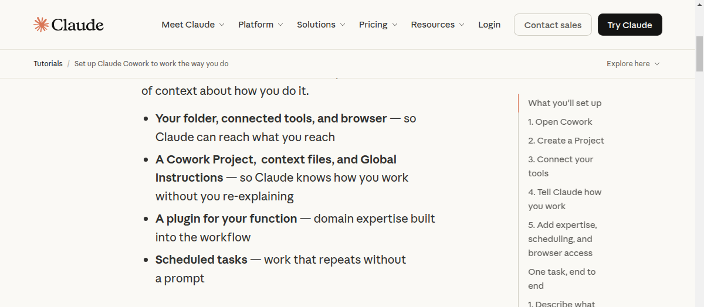

---

## 1. Mở Cowork

*Mở [ứng dụng Claude Desktop](https://claude.com/download) → ở phía trên cùng, click **Cowork**. Yêu cầu gói đăng ký [Pro hoặc Max](https://claude.com/pricing).*

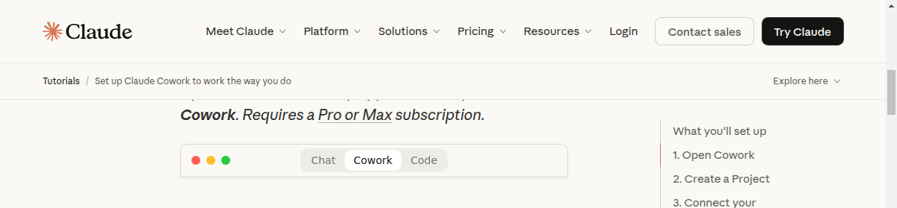

> **Giao diện thanh chế độ:**
>
> | Chat | **Cowork** | Code |
> |------|-----------|------|

---

## 2. Tạo Project

*Ở sidebar, tìm **Projects** và click nút "+" để thấy ba cách tạo project: bắt đầu từ đầu, import project, hoặc dùng thư mục có sẵn.*

Project cho công việc của bạn một "ngôi nhà". Thư mục bạn chọn là nơi Claude có thể làm việc. Với mỗi tác vụ bạn bắt đầu bên trong Project, Claude đã sẵn có context về công việc đang diễn ra bên trong. Tìm hiểu thêm về cách thiết lập Projects [tại đây](https://support.claude.com/en/articles/15925821-organize-your-tasks-with-projects-in-cowork).

Claude có thể đọc mọi file bên trong (PDF, bảng tính, tài liệu Word, bất kỳ gì có trong đó) và lưu kết quả hoàn thành về cùng chỗ. Claude đọc báo cáo cũ của bạn để giữ đúng format, tham khảo template mà không cần bạn chỉ dẫn.

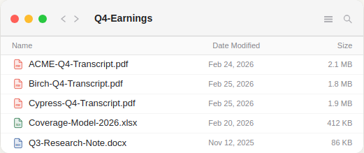

> **Ví dụ thư mục Project:**
>
> | Tên file | Ngày sửa đổi | Kích thước |
> |---|---|---|
> | ACME-Q4-Transcript.pdf | Feb 24, 2026 | 2.1 MB |
> | Birch-Q4-Transcript.pdf | Feb 25, 2026 | 1.8 MB |
> | Cypress-Q4-Transcript.pdf | Feb 25, 2026 | 1.9 MB |
> | Coverage-Model-2026.xlsx | Feb 20, 2026 | 412 KB |
> | Q3-Research-Note.docx | Nov 12, 2025 | 86 KB |

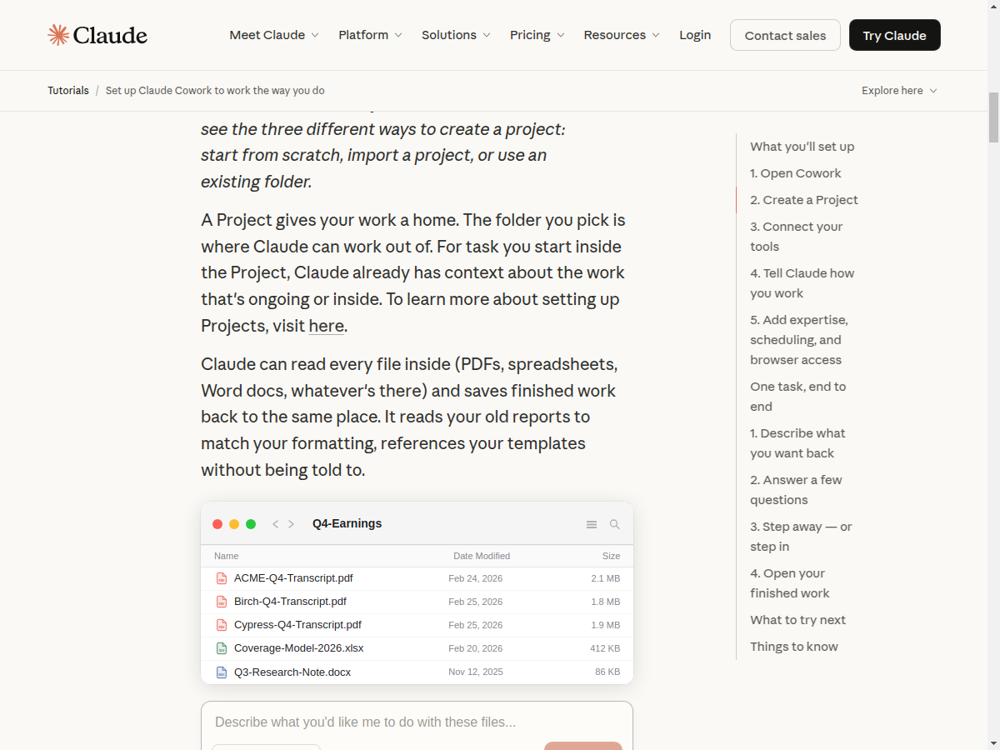

---

## 3. Kết nối công cụ của bạn

*Mở sidebar **Customize** → kết nối và bật các công cụ mà công việc của bạn đang sử dụng.*

Kết nối các công cụ như [Slack, Google Drive, Calendar, Gmail](https://support.claude.com/en/articles/15893973-use-connectors-in-cowork) — bạn chỉ cần làm một lần, và mỗi tác vụ từ đó trở đi đều có thể truy cập chúng.

Thay vì copy một thread Slack vào prompt, bạn chỉ cần đề cập nó ("kiểm tra những gì team nói trên Slack về báo cáo tuần này") và Claude sẽ tự tìm các tin nhắn liên quan. Claude cũng có thể thao tác trong các công cụ đã kết nối: soạn nháp email trong Gmail, lưu file vào Drive, để lại bình luận ở nơi cuộc thảo luận đang diễn ra.

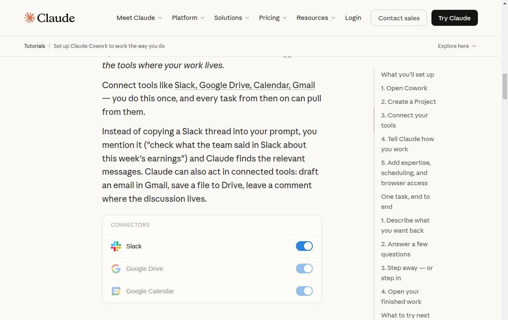

> **Connectors:**
> - Slack
> - Google Drive
> - Google Calendar

---

## 4. Cho Claude biết cách bạn làm việc

*Click vào Project của bạn và tìm ô instructions → viết những gì Claude cần biết.*

Mỗi Project có **Instructions** được áp dụng cho mọi tác vụ bạn bắt đầu bên trong nó — Claude đọc instructions cùng với mọi thứ trong thư mục của bạn.

Bạn viết gì vào đó là tùy bạn. Đó là context cố định mà bạn thường phải giải thích lại ở đầu mỗi prompt: vai trò và chức năng của bạn, format output mặc định, vị trí các thứ nằm ở đâu trong các công cụ, những quyết định bạn muốn Claude luôn xử lý giống nhau.

Với những thứ cần thay đổi liên tục — nhật ký quyết định, ghi chú phát triển theo công việc — hãy đặt chúng vào **file trong thư mục** thay vì Instructions. Câu lệnh "Thêm những gì chúng ta đã thảo luận vào file ghi chú" hoạt động với file; bảng Instructions là do bạn đặt và giữ nguyên như bạn viết.

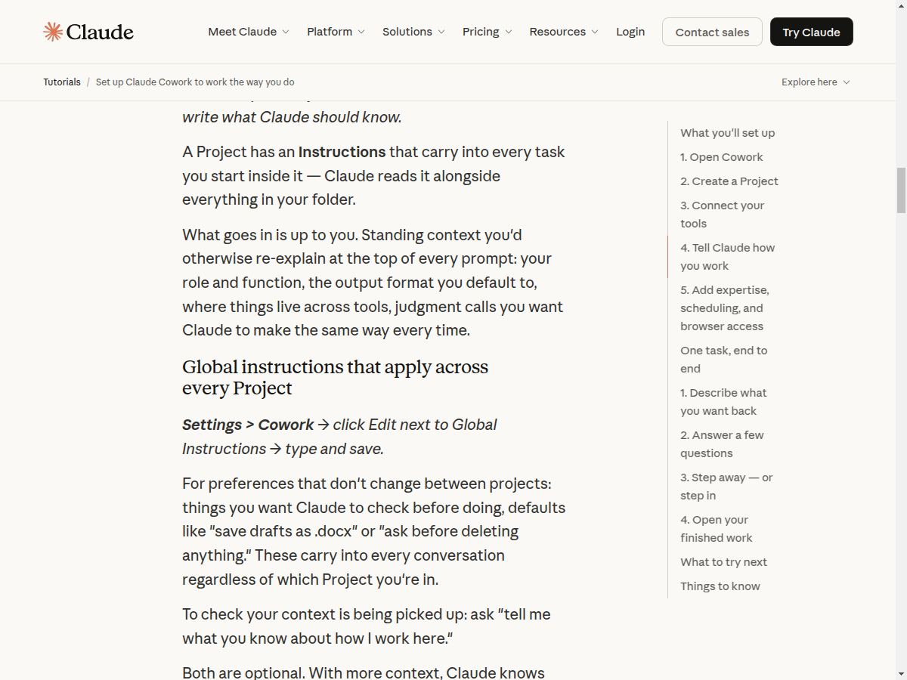

### Global Instructions — áp dụng cho mọi Project

***Settings > Cowork*** *→ click Edit bên cạnh Global Instructions → gõ và lưu.*

Dành cho những ưu tiên không thay đổi giữa các project: những thứ bạn muốn Claude kiểm tra trước khi làm, mặc định như "lưu nháp dạng .docx" hoặc "hỏi trước khi xóa bất cứ gì." Chúng được áp dụng vào mọi cuộc hội thoại bất kể bạn đang ở Project nào.

Để kiểm tra xem context đã được Claude nắm bắt chưa: hỏi *"tell me what you know about how I work here"* (cho tôi biết bạn biết gì về cách tôi làm việc ở đây).

Cả hai đều không bắt buộc. Với nhiều context hơn, Claude hiểu rõ hơn về công việc của bạn mà không cần bạn phải nói rõ mỗi lần.

---

## 5. Thêm chuyên môn, lên lịch, và truy cập trình duyệt

Mỗi tính năng dưới đây mở rộng Cowork theo một hướng khác nhau, tùy thuộc vào công việc của bạn yêu cầu gì.

### Plugins

*Mở sidebar **Customize** → Plugins → cài plugin phù hợp với vai trò của bạn.*

Nếu bạn muốn output có chuyên môn ngành tích hợp sẵn (framework phân tích tài chính, quy trình bán hàng, checklist review pháp lý), hãy cài plugin cho chức năng của bạn.

Một prompt duy nhất có thể chạy toàn bộ quy trình có cấu trúc với chuyên môn đã được tích hợp. Bạn cũng có thể [tùy chỉnh plugin có sẵn](https://support.claude.com/en/articles/16316375-customize-plugins-in-cowork) hoặc [tự tạo plugin riêng](https://support.claude.com/en/articles/16316455-build-your-own-cowork-plugin) cho quy trình cụ thể của team bạn. [Tìm hiểu thêm về plugins →](https://support.claude.com/en/articles/15980973-use-plugins-in-cowork)

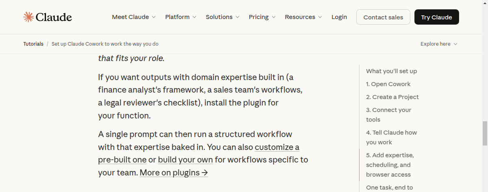

### Tác vụ lên lịch (Scheduled tasks)

*Gõ `/schedule` trong bất kỳ cuộc hội thoại nào, hoặc vào tab **Scheduled** ở sidebar → + New Task.*

Khi bạn có một tác vụ hoạt động tốt (báo cáo tình hình, tóm tắt tuần, kéo dữ liệu), bạn có thể đặt nó chạy tự động theo lịch mà không cần nhắc mỗi lần.

Claude sẽ hướng dẫn bạn về tần suất, thư mục, và kết quả mong muốn. Miễn là ứng dụng Claude Desktop đang mở, tác vụ sẽ tự chạy và file hoàn thành đang chờ khi bạn kiểm tra. Nếu không, tác vụ sẽ chạy ngay khi bạn mở lại app. [Tìm hiểu thêm về scheduled tasks](https://support.claude.com/en/articles/15893900-schedule-recurring-tasks-in-cowork)

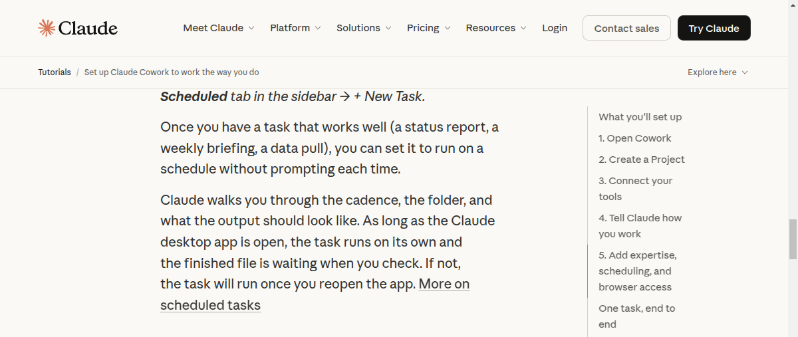

### Claude in Chrome

*Mở sidebar **Customize** → Claude in Chrome → cài extension và bật.*

Nếu công việc của bạn nằm sau đăng nhập (dashboard, admin panel, web app), Claude in Chrome cho phép Cowork nhìn thấy trình duyệt của bạn và làm việc bên trong nó.

Cowork có thể click qua các trang, điền form, lấy dữ liệu từ bất cứ thứ gì bạn đã đăng nhập, và thực hiện thay đổi trong các công cụ web tương tự cách nó ghi vào thư mục của bạn. Chỉ cấp quyền truy cập trình duyệt cho các trang web bạn tin tưởng. [Tìm hiểu thêm về Claude in Chrome](https://support.claude.com/en/articles/16056413-use-claude-in-chrome-with-cowork)

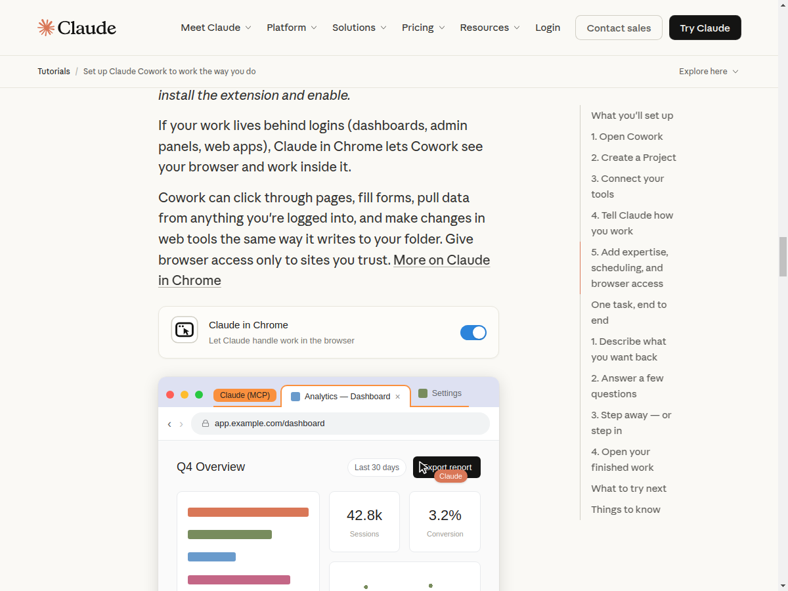

---

## Một tác vụ hoàn chỉnh, từ đầu đến cuối

Đây là cách nó hoạt động trong thực tế — một analyst cập nhật báo cáo nghiên cứu trong mùa báo cáo thu nhập. Quy trình tương tự cho bất kỳ tác vụ nào mà bạn lấy từ file và công cụ để tạo ra sản phẩm hoàn chỉnh.

---

### 1. Mô tả kết quả bạn muốn

Một prompt hoạt động tốt khi cung cấp cho Claude **cần xem gì**, **bạn muốn nhận lại gì**, và **lưu ở đâu**. Bạn không cần viết prompt hoàn hảo. Claude sẽ hỏi thêm với bất cứ gì bạn chưa nói rõ.

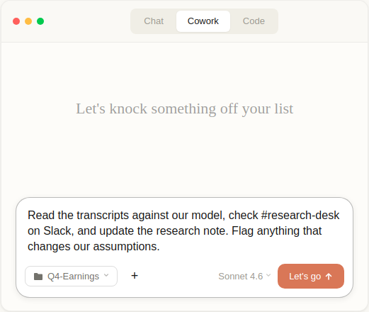

---

### 2. Trả lời vài câu hỏi

**Dựa trên prompt và những gì nó tìm thấy, Claude hỏi vài câu hỏi để cho ra kết quả chính xác** — nên dùng cách tiếp cận nào, ưu tiên gì, kết quả hoàn thành trông như thế nào.

Chọn một trong các tùy chọn Claude đưa ra, hoặc gõ câu trả lời riêng. Nếu câu hỏi không hợp lý, nói cho Claude biết và nó sẽ hỏi khác.

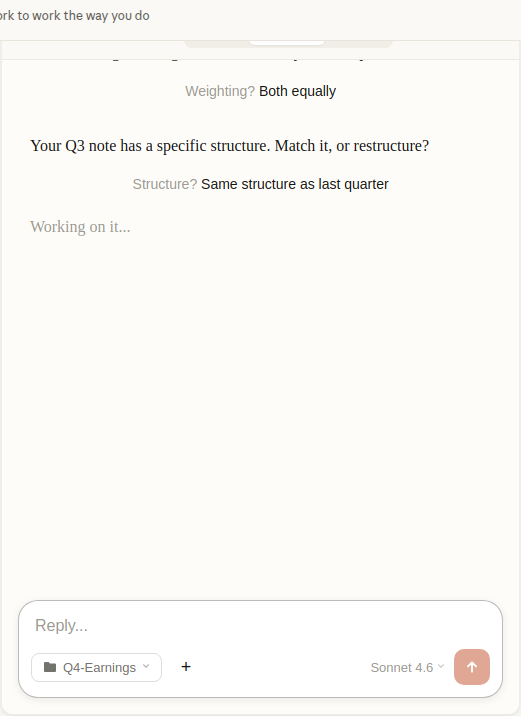

> **Ví dụ prompt:** *"Đọc các transcript so với model của chúng ta, kiểm tra #research-desk trên Slack, và cập nhật báo cáo nghiên cứu. Flag bất cứ gì thay đổi giả định của chúng ta."*
>
> **Claude hỏi:**
>
> | Câu hỏi | Tùy chọn | Lựa chọn |
> |---|---|---|
> | Giả định nào quan trọng nhất? | 1. Tăng trưởng doanh thu 2. Xu hướng biên lợi nhuận 3. Vị thế cạnh tranh 4. **Cả ba** | Cả ba |
> | Nên cân nhắc dữ liệu thế nào? | 1. Tone ban lãnh đạo 2. Số liệu báo cáo 3. **Cân bằng cả hai** | Cân bằng cả hai |
> | Cấu trúc báo cáo? | 1. **Giống quý trước** 2. Tái cấu trúc theo thay đổi 3. Tùy bạn chọn | Giống quý trước |

---

### 3. Rời đi — hoặc nhảy vào

**Bảng tiến độ hiển thị từng bước** — Claude đang đọc file nào, đang xây dựng gì.

Với tác vụ lớn, Claude chia công việc thành các phần và xử lý chúng cùng lúc: đọc nhiều file, lấy dữ liệu từ công cụ đã kết nối, tìm kiếm web, tất cả đồng thời với việc soạn kết quả. Loại công việc đa nguồn mà thường chiếm hết ngày của bạn sẽ chạy ngầm.

Rời đi và quay lại sau, hoặc gõ trong chat để điều hướng nếu bạn thấy Claude đang đi sai hướng. App vẫn mở; bạn không cần phải ngồi trước máy.

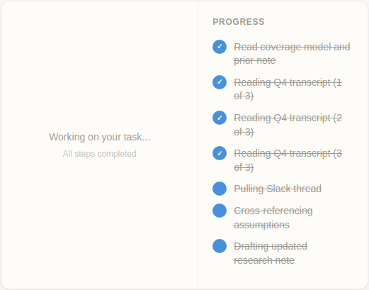

> **Tiến trình thực hiện:**
>
> | # | Bước | Trạng thái |
> |---|---|---|
> | 1 | Đọc coverage model và báo cáo trước | Hoàn thành |
> | 2 | Đọc transcript Q4 (1/3) | Đang chạy |
> | 3 | Đọc transcript Q4 (2/3) | Đang chạy |
> | 4 | Đọc transcript Q4 (3/3) | Đang chạy |
> | 5 | Pull thread Slack | Chờ |
> | 6 | Cross-reference giả định | Chờ |
> | 7 | Soạn nháp báo cáo cập nhật | Chờ |
>
> *3 bước đang chạy đồng thời*

---

### 4. Mở kết quả đã hoàn thành

**Kết quả nằm ở nơi bạn chỉ định.** Trong ví dụ này, đó là thư mục, lưu ngay bên cạnh các transcript và model.

Nếu prompt yêu cầu khác ("soạn nháp email trong Gmail" hoặc "lưu vào thư mục Drive chung"), kết quả sẽ xuất hiện ở đó.

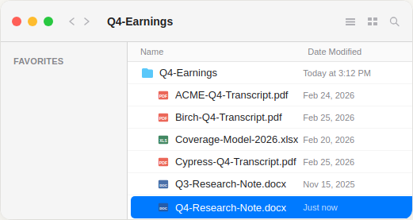

> **Thư mục sau khi hoàn thành:**
>
> | Tên file | Ngày sửa đổi | Kích thước |
> |---|---|---|
> | ACME-Q4-Transcript.pdf | Feb 24, 2026 | 2.1 MB |
> | Birch-Q4-Transcript.pdf | Feb 25, 2026 | 1.8 MB |
> | Coverage-Model-2026.xlsx | Feb 20, 2026 | 854 KB |
> | Cypress-Q4-Transcript.pdf | Feb 25, 2026 | 1.6 MB |
> | Q3-Research-Note.docx | Nov 15, 2025 | 342 KB |
> | **Q4-Research-Note.docx** | **Vừa xong** | **128 KB** |

---

## Thử gì tiếp theo

**Tóm tắt thông tin rời rạc** — Claude đọc từ nhiều nguồn; bạn nhận bức tranh toàn cảnh ở một nơi.

> *"Tìm trong thư mục và Slack mọi thứ liên quan đến [dự án]. Cho tôi bản tóm tắt 1 trang về tiến độ hiện tại."*

**Biến bản nháp thành sản phẩm hoàn chỉnh** — suy nghĩ đã có trong file của bạn — Claude thực hiện phần định hình.

> *"Lấy ghi chú trong file này và biến thành bản memo sẵn sàng gửi khách hàng. Giữ format giống bản gần nhất tôi đã gửi."*

**Thiết lập tác vụ định kỳ** — Gõ `/schedule` và cho Claude biết cần chạy gì, khi nào, và lưu ở đâu. Báo cáo tuần bạn soạn mỗi thứ Sáu trở thành file đã sẵn sàng khi bạn ngồi xuống.

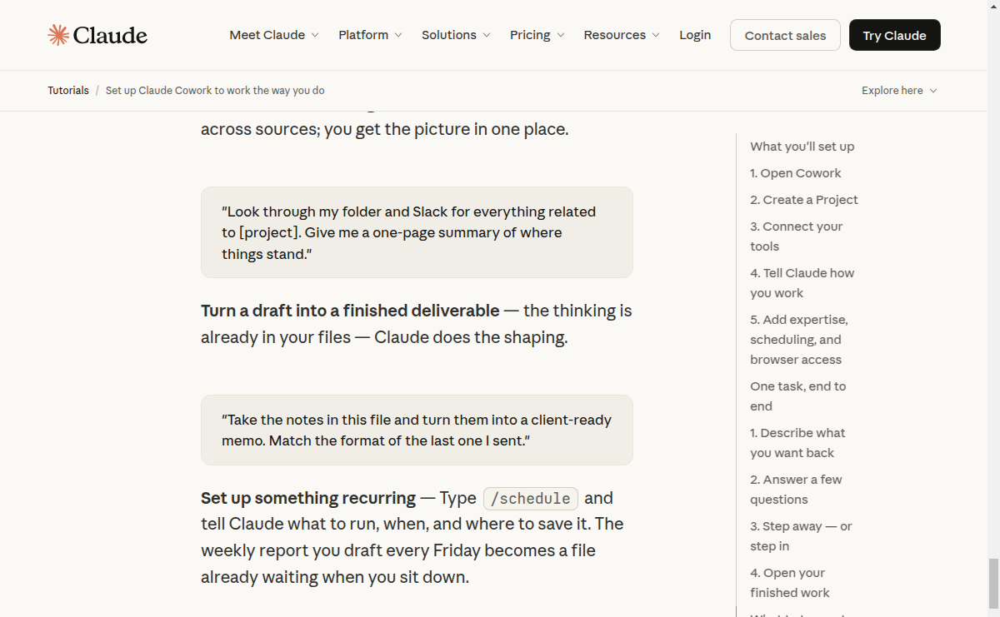

---

## Những điều cần biết

- **Đặt thông tin quan trọng vào file** — Cowork không nhớ giữa các phiên như Claude trong chat. Bất cứ gì bạn muốn Claude luôn biết đều nên nằm trong Projects, Global Instructions hoặc file trong thư mục. Ưu điểm: context của bạn luôn hiển thị và có thể chỉnh sửa, và bạn có thể chia sẻ với bất kỳ ai làm việc tương tự.

- **Tác vụ lớn hơn tốn nhiều usage hơn** — Tác vụ đọc nhiều file và chạy lâu tốn nhiều hơn một câu hỏi nhanh. **Settings > Usage** cho thấy bạn đang ở đâu. Max cho nhiều dung lượng hơn nếu bạn chạy tác vụ nặng hàng ngày.

- **Research preview** — Có sẵn cho Pro, Max, Team, và Enterprise trên ứng dụng desktop.

---

## Tải Claude Desktop

> [**Tải Claude Desktop tại đây**](https://claude.com/download)

---

## Hướng dẫn liên quan

- [Sử dụng Claude Design cho prototype và UX](https://claude.com/resources/tutorials/design-prototypes-ux)
- [Sử dụng Claude Design cho bài thuyết trình và slide](https://claude.com/resources/tutorials/design-presentations-slide-decks)
- [Làm việc thông minh hơn với Claude trong PowerPoint](https://claude.com/resources/tutorials/working-smarter-powerpoint)
- [Tinh chỉnh PowerPoint với Claude](https://claude.com/resources/tutorials/refining-powerpoint-with-claude)

---

> **Bài hướng dẫn gốc:** [claude.com/resources/tutorials/cowork-onboarding-guide](https://claude.com/resources/tutorials/cowork-onboarding-guide)
>
> **Dịch bởi:** Cộng đồng người dùng Claude Việt Nam
>
> **Cập nhật:** Tháng 4/2026
